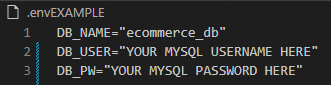
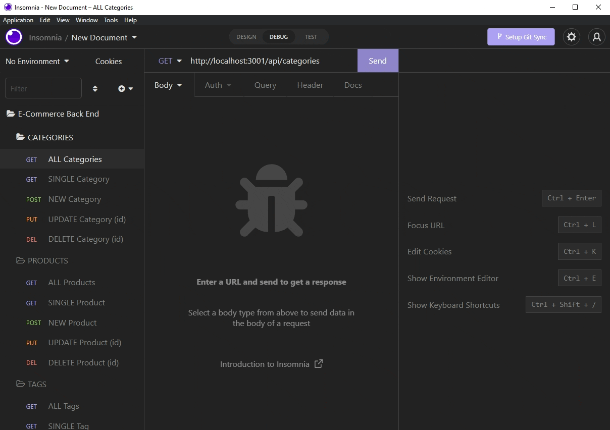
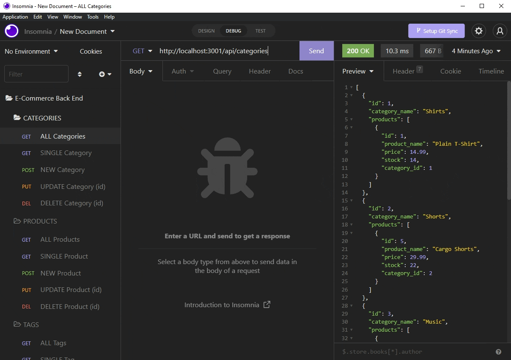
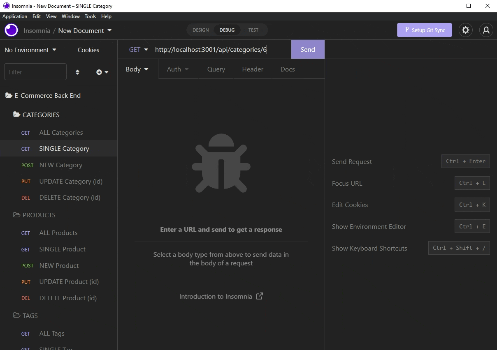
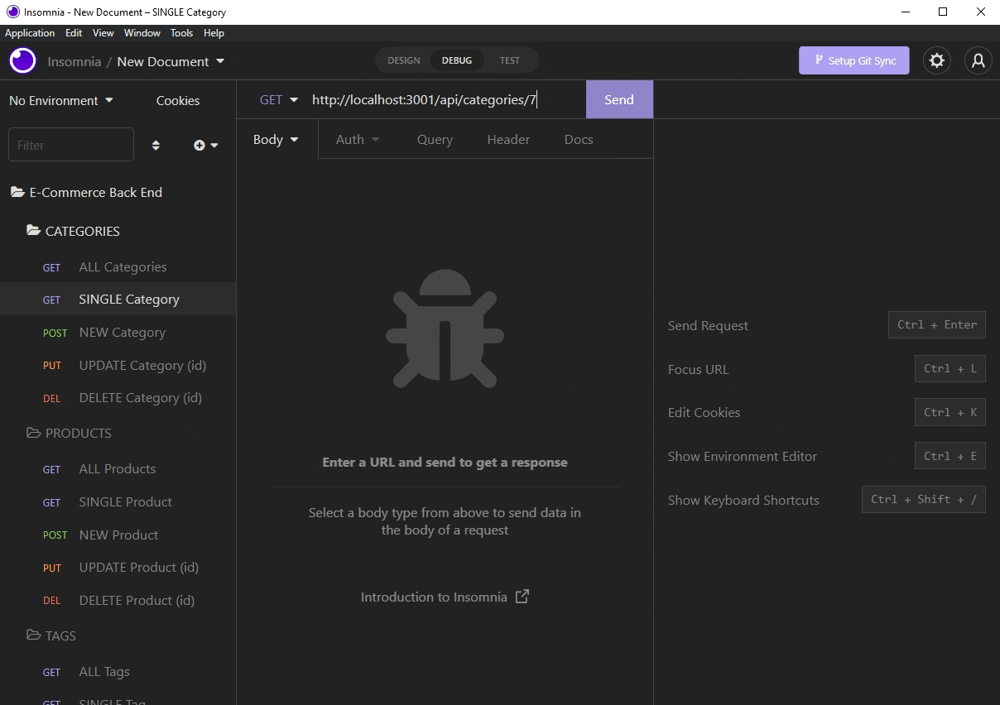

# ORM: E-Commerce Back End

## Table of Contents

* [Description](#description)
* [Installation](#installation)
* [Usage](#usage)
* [Testing](#testing)
* [Contributions](#contributions)
* [Additional Information](#additional-information)

## [Description:](#table-of-contents)
E-Commerce Back End is a Node application for performing CRUD (create, read, update, delete) functions on products, product categories, and product tags in a fictional database for learning purposes. Focusing on using Sequelize to create Models, associations/relationships between Models, and creating GET, PUT, POST, and DELETE routes for API use. 

_User Story:_
```
AS A manager at an internet retail company
I WANT a back end for my e-commerce website that uses the latest technologies
SO THAT my company can compete with other e-commerce companies
```


## [Installation:](#table-of-contents)
This is a back-end application with no front-end implementation, but requires MySQL. Please ensure you have MySQL installed on your machine. *For information on how to install MySQL please click [here](https://coding-boot-camp.github.io/full-stack/mysql/mysql-installation-guide)*

1. Clone this repository onto your machine with `git clone`
2. From the root directory, install dependencies with `npm install`
3. Open a connection to MySQL in the root directory, and create the database with `source db/schema.sql`
4. Return to the command line and run command `npm run seed` to seed the database with provided data

## [Usage:](#table-of-contents)
Walkthrough Videos:
1. [Installation](https://drive.google.com/file/d/1QdU3CCgy028uUsrlLauXyX6hK7xvcf-B/view)
2. [Models & Associations Breakdown](https://drive.google.com/file/d/1WkfLIEYDlrexxrXYyV0YollMr8PfgOAZ/view)
3. [GET Routes](https://drive.google.com/file/d/10QfYwE7i_jMkE0jLQe3ngblDKQE9b-Ib/view)
4. [POST Routes](https://drive.google.com/file/d/1xvnhDJTw1mQZZva8w2U0zPtff2cXSrS0/view)
5. [PUT / DELETE Routes](https://drive.google.com/file/d/1ix0ynIVW9LSX4mGBjiz88wBLVG1dW-F4/view)

***

Once dependencies have been installed, make a copy of the **.envEXAMPLE** file, drop the **EXAMPLE** portion in the name, and fill in the required fields with your MySQL username and password (note: username is usually *root* if working on your own machine):



Start the database connection and server from the command line with `npm start`, then you can use a REST Client (Insomnia used in examples) to test endpoints:

**Finding all Categories, Products, Product Tags:**



**Finding individual Categories, Products, Product Tags using ids (PrimaryKeys):**



**Create new instances of Categories, Products, Product Tags:**


**Update Categories, Products, Product Tags:**



**Delete Categories, Products, Product Tags using ids (PrimaryKeys):**



## [Testing:](#testing)
As seen above, test API endpoints with a REST Client such as [Insomnia](https://insomnia.rest/) or [Postman](https://www.postman.com/)

## [Contributions:](#table-of-contents)
Contributions always welcome!

## [Additional Information:](#table-of-contents)
Technologies Used:
* Node.js
* Express.js
* MySQL
* [Sequelize](https://sequelize.org/)

Noteable Packages Used:
* [mysql2](https://www.npmjs.com/package/mysql2) (*required*)
* [dotenv](https://www.npmjs.com/package/dotenv) (*required*)
* [nodemon](https://www.npmjs.com/package/nodemon)

_If you have any questions about the application, or would like to become a contributor, please contact me using the information below:_

[GitHub](https://github.com/blindsweatyhansolo)